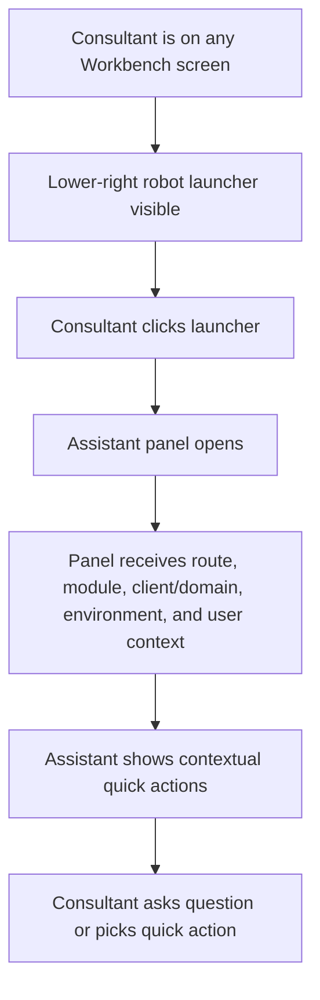
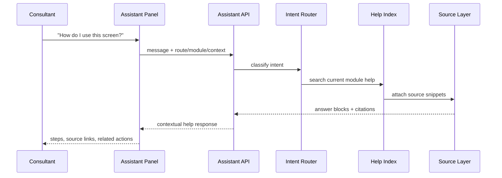
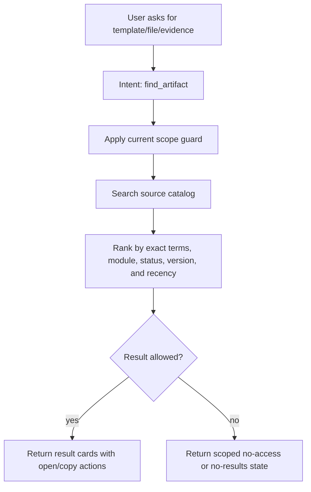
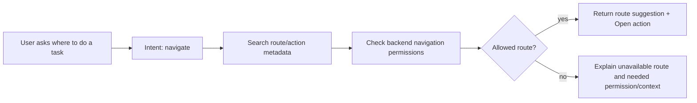
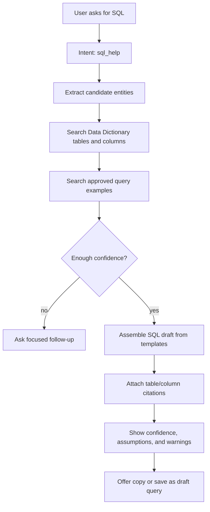
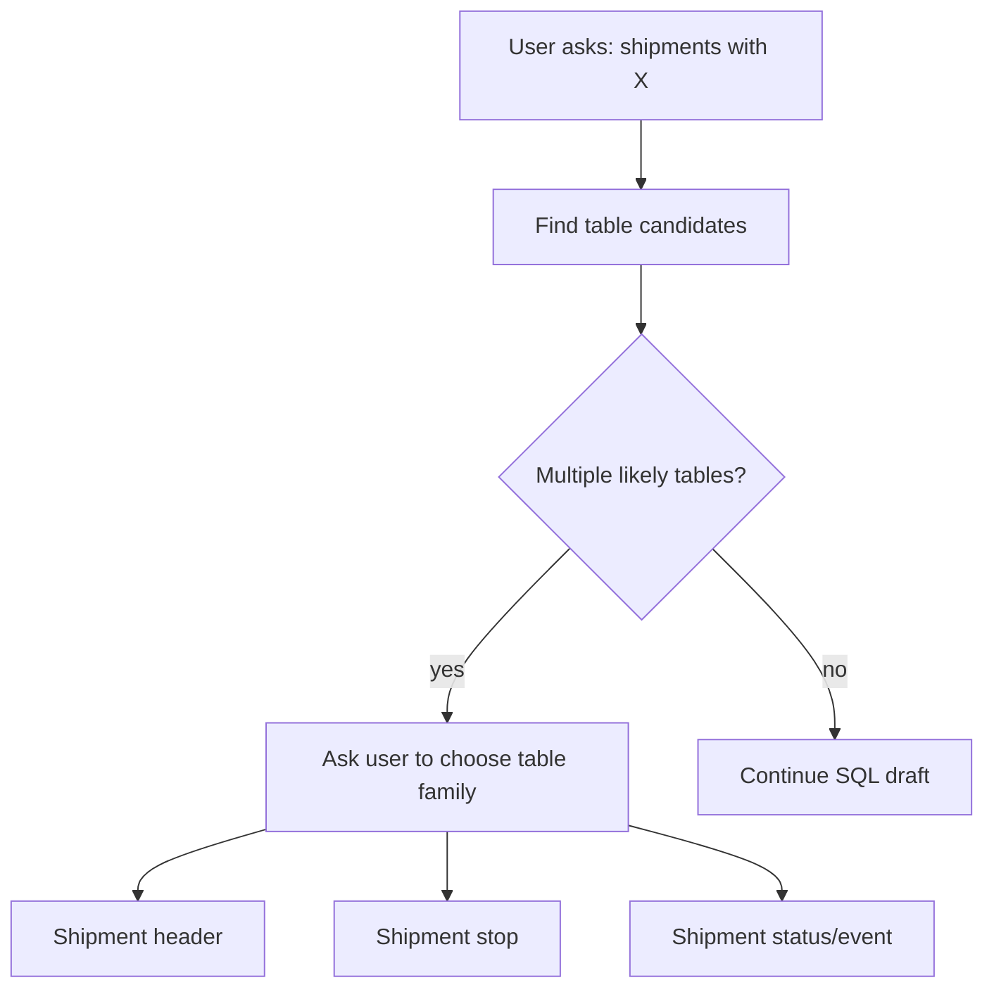
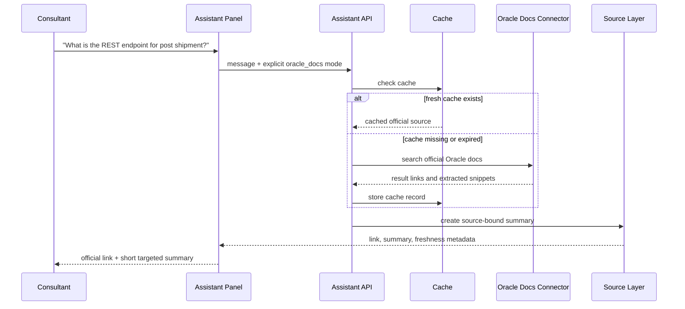
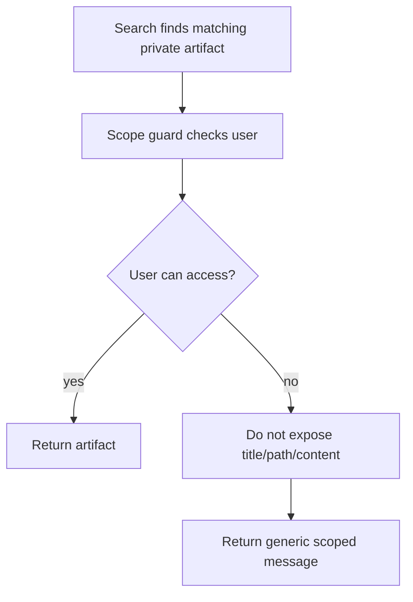
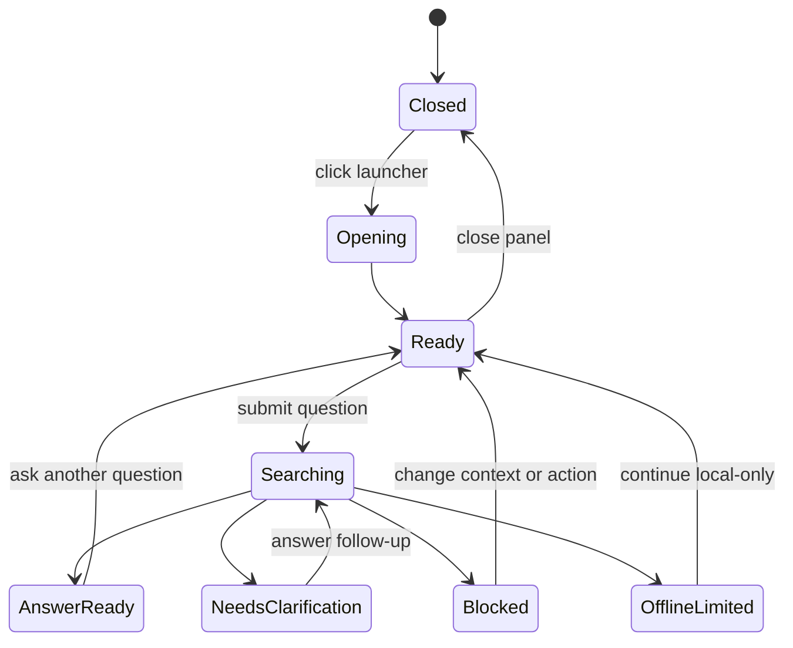

# Workbench Assistant Macroflows And Microflows

## User Entry Flow



## Macroflow: Ask For Help On Current Screen



Expected answer shape:

```text
This screen is used to review rate batch issues.

Steps:
1. Check blocker summary.
2. Open the table detail if the issue references a table.
3. Fix source data or return to staging.

Sources:
- Rates Studio help index
- Current route metadata
```

## Macroflow: Find Template Or File



Result card fields:

```text
title
source_type
module
client/domain
environment
visibility
status
version/current flag
path or route target
last indexed timestamp
```

## Macroflow: Navigate To Workbench Area



Navigation suggestions should never be hardcoded only in the frontend. They
should use backend-owned navigation and module capability metadata.

## Macroflow: SQL Helper



SQL generation must be template-led, not free-form:

```text
select template
  -> table/column resolution
  -> join pattern lookup
  -> user-supplied filter insertion
  -> dictionary citation
  -> saved-query comparison
  -> draft output
```

SQL response should include:

```text
purpose
query draft
tables used
columns used
join assumptions
filters requiring user input
sources
confidence
copy/save actions
```

## SQL Helper Microflow: Ambiguous Table



The assistant should prefer a short clarification over generating a confident
but wrong query.

## Macroflow: Oracle Documentation Lookup



Oracle docs rules:

- Search should prefer official Oracle domains.
- Response must include a link.
- Response must distinguish official source content from Workbench inference.
- Cache must include fetch time and expiration.
- If no official source is found, the assistant should say so.

## Microflow: Permission-Denied Result



Generic response:

```text
I found matching material outside your current accessible scope. Change context
or request access if you expected to see it.
```

Do not reveal private client names, file titles, paths, or snippets through the
denied response.

## UI State Map



## Contextual Quick Actions

Quick actions should vary by current route/module:

| Context | Suggested actions |
|---|---|
| Cockpit | Help for this context, find project info, explain Public View |
| Master Data | Find template, validate dependency, build SQL from table |
| Rates | Find rate query, explain batch issue, open table detail help |
| Load Plan | Find cutover package, explain CSVUTIL sequence, find evidence |
| Integration | Explain mapping field, find payload artifact, Oracle docs lookup |
| Order Release | Find template, explain XML preview, find generated artifact |
| Assets | Find template/file, explain version/link/archive |
| Settings | Explain user/role/grant/policy, find access scope guidance |

## Response Contract

Every answer should be structured internally as:

```json
{
  "answer_type": "help|search_results|sql_draft|oracle_docs|navigation|blocked",
  "summary": "...",
  "steps": [],
  "actions": [],
  "sources": [],
  "confidence": "high|medium|low",
  "source_mode": "indexed|cached|live_official|generated_draft",
  "cost_level": "local|web|ai|web_plus_ai",
  "scope": {
    "project_id": "...",
    "domain_name": "...",
    "environment_name": "...",
    "visibility": "..."
  }
}
```

The UI can render this as conversational text, but the backend should keep the
contract structured.
