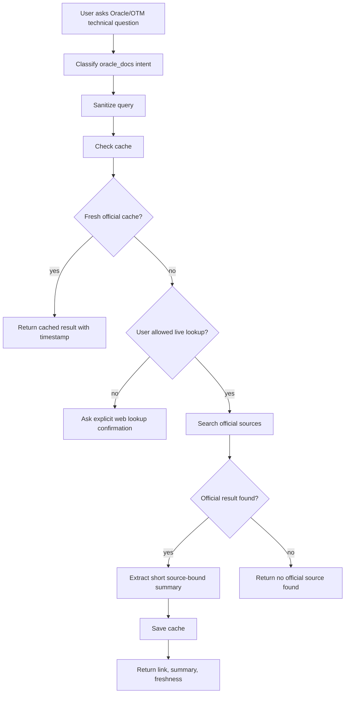

# Workbench Assistant Oracle Docs Connector Policy

## Purpose

The Oracle Docs connector lets the assistant answer questions that depend on
current official Oracle documentation. It must be controlled, source-bound,
cache-aware, and clearly separated from local Workbench knowledge.

## Policy Summary

```text
official source required
explicit live lookup
local cache with freshness
no private data in external queries
no fabricated answer when source is missing
```

## Allowed Source Scope

The connector should prefer official Oracle documentation domains.

Initial allowlist concept:

```text
docs.oracle.com
oracle.com
```

Before implementation, confirm whether any Oracle Cloud documentation hostnames
or support-document sources should be included. Do not include forums, blogs,
Stack Overflow, or copied documentation as authoritative sources.

## Query Hygiene

The assistant must not send client-specific data to external documentation
search.

Before live lookup:

- remove client names;
- remove project names;
- remove environment names;
- remove credentials, URLs, tokens, and hostnames;
- convert user question into generic Oracle/OTM terms.

Example:

```text
User: "For client ACME in UAT, what REST endpoint posts shipment?"
External query: "Oracle Transportation Management REST API post shipment endpoint"
```

## User Experience

Live lookup should be explicit. The assistant can say:

```text
This depends on current Oracle documentation. I can search official Oracle docs.
```

The action should identify cost/source mode:

```text
Search official Oracle docs
Mode: web
```

If a fresh cache exists, the assistant can answer from cache and offer refresh:

```text
Official Oracle source, cached on 2026-05-28. Refresh from Oracle docs.
```

## Connector Flow



## Cache Rules

Recommended cache fields are defined in `DATA_MODEL_DRAFT.md`.

Cache behavior:

- cache by normalized query and canonical URL;
- store fetched timestamp;
- store expiration timestamp;
- preserve official-source flag;
- show cached status in UI;
- allow refresh when online.

Default expiration should be chosen during implementation. For planning, assume
short enough to avoid stale technical guidance and long enough to avoid repeat
lookups for common questions.

## Summary Rules

Summaries must be short and source-bound.

Allowed:

- paraphrase the relevant documentation;
- explain how it relates to the user's Workbench context;
- cite the official link;
- mention uncertainty or version mismatch.

Not allowed:

- long copied Oracle text;
- answer without link;
- mix unofficial sources into official answer;
- state a version-specific fact without version/source;
- include private client context in the summary.

## Failure States

| Failure | Response |
|---|---|
| no network | local-limited state, offer cached results if available |
| no official result | say no official source found |
| unofficial result only | do not treat as authoritative |
| cache expired | show expired cached status and offer refresh |
| parser failure | show link and state summary could not be extracted |
| query contains private terms | sanitize before lookup and record sanitized query only |

## Validation Requirements

Future implementation should test:

- sanitized query excludes private terms;
- official cache hit returns without live lookup;
- expired cache asks refresh or labels freshness;
- unofficial sources are rejected as authority;
- network failure returns local-limited state;
- no official source does not fabricate answer;
- response includes URL and fetched/cache timestamp.

## Implemented Cache Foundation

The first backend foundation is implemented for reviewed local cache records
only:

- admins can create Oracle documentation cache records;
- cache records must use official documentation URLs:
  - `https://docs.oracle.com/...`
  - `https://www.oracle.com/.../documentation/...`
- admins can approve cache records;
- authenticated users can search approved records by query, product area, and
  topic;
- live lookup requests return a blocked response with `cost_level: web` so the
  caller can display that external lookup is not enabled yet.

Implemented endpoints:

- `POST /api/v1/assistant/oracle-docs/cache`
- `POST /api/v1/assistant/oracle-docs/cache/{record_id}/approve`
- `GET /api/v1/assistant/oracle-docs/search`
- `POST /api/v1/assistant/oracle-docs/live-lookup`

This slice intentionally does not crawl Oracle, search the internet, summarize
remote pages, or open browser pages. Those behaviors remain separate future
slices that must preserve explicit user action, query sanitization, official
source filtering, and freshness labels.

## Implemented Lookup Request Preparation

The Assistant can now prepare an explicit Oracle documentation lookup request
without executing a web request:

- the user query is sanitized before any external action is offered;
- caller-supplied private terms such as client, project, and environment names
  are removed;
- URL-like and long token-like values are stripped;
- official Oracle search links are generated under `https://docs.oracle.com`;
- the response declares `network_performed: false` and `cost_level: web`.

The `/api/v1/assistant/oracle-docs/live-lookup` endpoint now returns a
`lookup_request` payload. It is still not a live search connector. Future UI can
show the sanitized query and official Oracle search action, and a later backend
slice can add an explicit approved network call with source/freshness capture.
