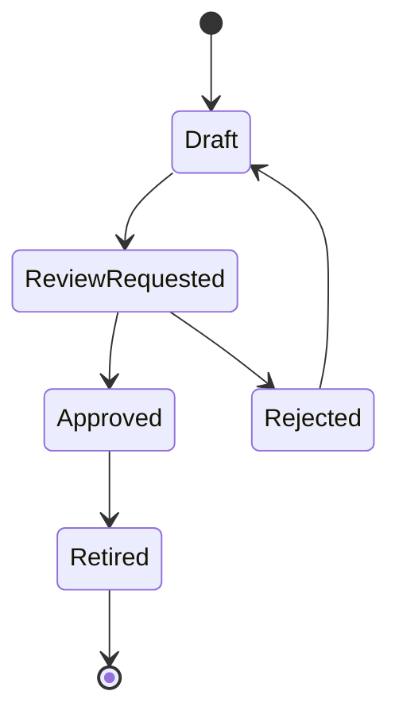

# Workbench Assistant Query Corpus Strategy

## Purpose

The SQL Helper needs trusted examples and join patterns. This document defines
how saved queries should become a useful local corpus without relying on real
client data or free-form model generation.

## Corpus Goals

The query corpus should help the assistant:

- find approved examples;
- resolve common OTM business terms to tables;
- identify known join patterns;
- suggest select-only SQL drafts;
- explain pasted SQL;
- flag unknown or unsafe references.

## Corpus Source Types

| Source | Use | Notes |
|---|---|---|
| synthetic seed queries | baseline examples | safe for tests/docs |
| approved consultant queries | trusted examples | must be reviewed/sanitized |
| Data Dictionary metadata | table/column truth | required |
| curated join patterns | safe joins | explicit validation |
| retired queries | historical reference | hidden by default |

## Query Lifecycle



## Query Status Rules

### Draft

- created by user or assistant;
- scoped to user/project/domain/environment unless explicitly public;
- can be copied or reopened;
- does not rank as an approved example.

### Review Requested

- ready for lead/DBA review;
- should include purpose, tables, columns, and source citations.

### Approved

- can be used as a high-confidence example;
- contributes join patterns and ranking signals;
- must be synthetic or sanitized.

### Retired

- hidden by default;
- not used for suggestions unless explicitly included by authorized user.

## Required Query Metadata

```text
name
purpose
module
business terms
tables
columns
join patterns
parameters
status
scope
created_by
reviewed_by
reviewed_at
warnings
source citations
```

## Sanitization Rules

Approved examples must not include:

- real client names;
- production IDs;
- credentials;
- private hostnames;
- personal data;
- real order/shipment/customer values.

Use named parameters:

```sql
where shipment_gid = :shipment_gid
```

Do not use real literal values in approved examples.

## Join Pattern Extraction

Approved queries can seed join patterns, but extraction should be reviewed.

Candidate extraction:

```text
table A
column A
table B
column B
join type
business meaning
source query
confidence
```

The assistant should not treat an arbitrary query join as globally correct
until it is approved.

## Seed Corpus Candidates

Synthetic seed corpus should cover:

- shipment by GID;
- shipment stops;
- order release by GID;
- rate offering lookup;
- location lookup;
- refnum lookup;
- status/event lookup;
- domain/environment-filtered examples where applicable.

Each seed must be synthetic and Data Dictionary-backed.

## Ranking Strategy

Approved examples should rank by:

- exact table match;
- exact business term match;
- current module;
- current domain/environment when scoped;
- recent approval;
- query reuse count;
- lower warning count.

Drafts should rank only when explicitly searching user drafts.

## Future Validation

Tests should cover:

- draft query is not treated as approved;
- approved query contributes table/column search;
- retired query hidden by default;
- real-looking literal values are rejected from approval;
- join pattern is created only from approved source;
- query search respects scope.

## Implemented Foundation

The first saved query corpus foundation supports:

- draft saved query creation;
- SQL reference capture for single-table SELECT examples;
- approval only for SELECT-only, Data Dictionary-backed examples;
- rejection of quoted literal filters during approval;
- search of approved queries only by default;
- retired queries hidden from default search;
- scoped query visibility using the Assistant context rules.

Implemented endpoints:

- `POST /api/v1/assistant/sql/saved-queries`
- `POST /api/v1/assistant/sql/saved-queries/{query_id}/approve`
- `GET /api/v1/assistant/sql/saved-queries`

## Implemented Join Pattern Corpus

The first curated relationship corpus is implemented as an explicit review
surface rather than automatic extraction:

- join patterns are stored as draft records with left/right table and column
  references;
- approval checks both table/column pairs against the Data Dictionary;
- saved-query-backed patterns require an approved saved query source;
- approved join patterns are searchable by text or table name;
- draft patterns remain hidden from default search.

Implemented endpoints:

- `POST /api/v1/assistant/sql/join-patterns`
- `POST /api/v1/assistant/sql/join-patterns/{pattern_id}/approve`
- `GET /api/v1/assistant/sql/join-patterns`

Automatic join extraction from approved SQL is still deferred. The current
corpus supports manual or externally identified candidates that a reviewer can
approve before the Assistant uses them for future SQL drafts.

## Implemented Corpus Consumption

Approved join patterns can now be consumed by the SQL Helper for the first
joined draft path:

- only approved patterns are accepted;
- draft or warning-bearing patterns block generation;
- requested output and filter columns are rechecked against the Data
  Dictionary at draft time;
- generated drafts cite the Data Dictionary sources and the join pattern.

The corpus is still not self-expanding. Saved queries and join patterns remain
reviewed inputs until a later extraction workflow is explicitly designed and
validated.
