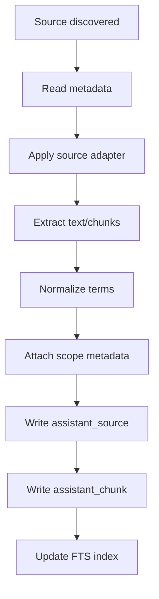
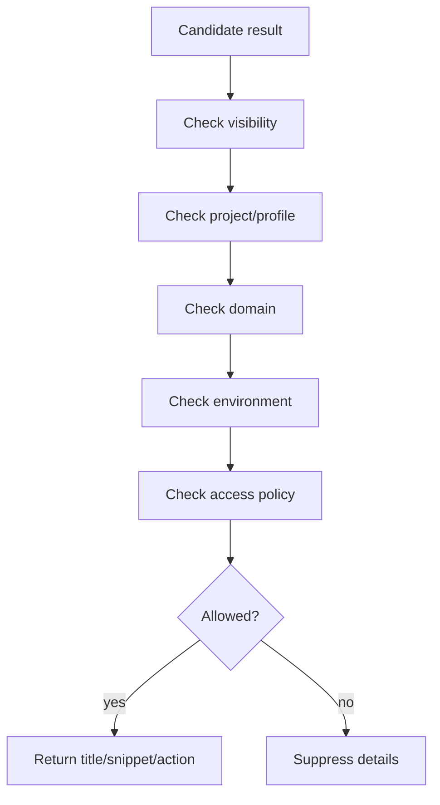

# Workbench Assistant Source Index Design

## Purpose

The source index is the assistant's local knowledge foundation. It should allow
the assistant to find Workbench help, templates, files, artifacts, evidence,
Data Dictionary entries, saved queries, and cached Oracle documentation without
requiring a heavy local AI model.

## Source Types

| Source type | Examples | Scope requirement |
|---|---|---|
| `workbench_doc` | module help, route help, process docs | public or internal |
| `route_metadata` | module, screen, action metadata | backend-owned |
| `asset` | files, templates, evidence support docs | scoped |
| `artifact` | generated CSV/XML/ZIP/output | scoped |
| `evidence` | validation/cutover evidence | scoped |
| `data_dictionary` | OTM tables and columns | shared technical |
| `saved_query` | approved/draft SQL examples | scoped or public |
| `oracle_cache` | cached official Oracle docs lookup | public/cache policy |
| `error_catalog` | known validation/blocker/error help | module scoped |

## Indexing Pipeline



## Source Record

Recommended fields:

```text
source_id
source_type
title
description
path_or_url
module_id
route_id
project_id
profile_id
domain_name
environment_name
visibility
access_policy_id
status
version_label
current_version
source_hash
indexed_at
expires_at
```

## Chunk Record

Recommended fields:

```text
chunk_id
source_id
heading
body
normalized_terms
rank_weight
line_start
line_end
source_anchor
```

## FTS Strategy

Use SQLite FTS5 as the baseline local search mechanism.

Search stages:

```text
normalize query
  -> identify likely intent/source types
  -> apply scope filter
  -> FTS query
  -> metadata rank boost
  -> source confidence score
  -> return cited snippets
```

## Ranking Boosts

Recommended ranking boosts:

- current route/module match;
- exact table/column match;
- current client/domain and environment match;
- `current_version=true`;
- `status=approved` or `status=validated`;
- source type aligns with intent;
- recently indexed or recently used;
- official Oracle domain for docs lookup.

## Scope Filtering

Scope filtering must happen before result snippets are shown.



## Cache Strategy

Oracle docs cache records should include:

```text
query_text
provider
url
title
snippet
summary
fetched_at
expires_at
source_hash
official_source_flag
```

Cached Oracle results should show freshness:

```text
Official Oracle source, cached on 2026-05-28.
```

If expired, the assistant can offer a refresh action.

## Reindexing Strategy

Reindexing should support:

- full rebuild;
- source-type rebuild;
- changed-source rebuild by hash;
- single asset/artifact/query reindex after mutation.

For local-first operation, reindexing should avoid long blocking UI work. Future
implementation can run it as a backend task or explicit maintenance action.

## Implemented Foundation

The first backend foundation now supports:

- manual text source creation through `/api/v1/assistant/sources`;
- SQLite FTS5 rebuild through `/api/v1/assistant/index/rebuild`;
- scoped search through `/api/v1/assistant/search`;
- approved Markdown intake through
  `/api/v1/assistant/index/workbench-docs`;
- scoped Asset intake through `/api/v1/assistant/index/assets/{asset_id}`;
- allowlisted source roots using `root_key`, not arbitrary filesystem paths;
- explicit `OTM_RESOURCES` path blocking;
- relative `workbench-doc://...` URIs for indexed Markdown files.
- relative `asset://...` URIs for indexed Asset versions;
- private/project source filtering by domain, project, environment, and
  profile during search.

## Index Health

The assistant should expose an internal health summary:

```text
indexed sources by type
last indexing run
failed sources
expired cache count
Data Dictionary availability
saved query count
```

This should be visible only to users with the appropriate diagnostic/admin
capability.

## Failure Modes

| Failure | Assistant behavior |
|---|---|
| source missing | return no-result with reindex suggestion |
| stale index | show indexed timestamp |
| private source denied | suppress details |
| Oracle lookup unavailable | continue local-only |
| Data Dictionary unavailable | block SQL draft and explain dependency |
| parser failed | record failed source and continue indexing others |

## Future Implementation Test Cases

- indexes Workbench Markdown help;
- indexes a scoped asset without leaking across domain;
- ranks current module docs higher than unrelated docs;
- returns no private snippets for unauthorized user;
- updates source hash after content changes;
- caches Oracle docs result with expiration;
- blocks SQL helper when Data Dictionary is absent;
- reports index health for authorized diagnostic user.
