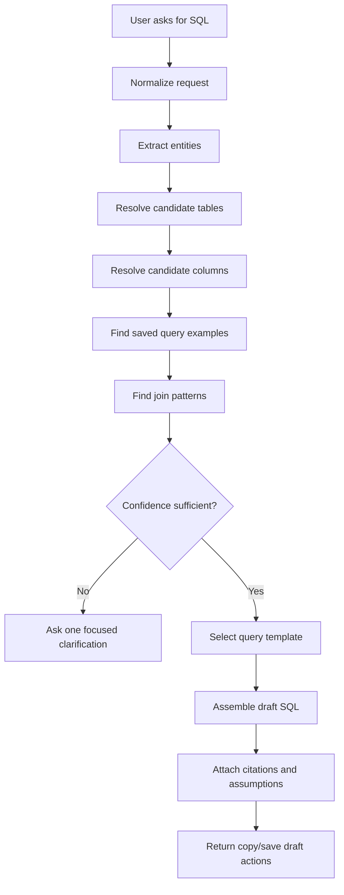
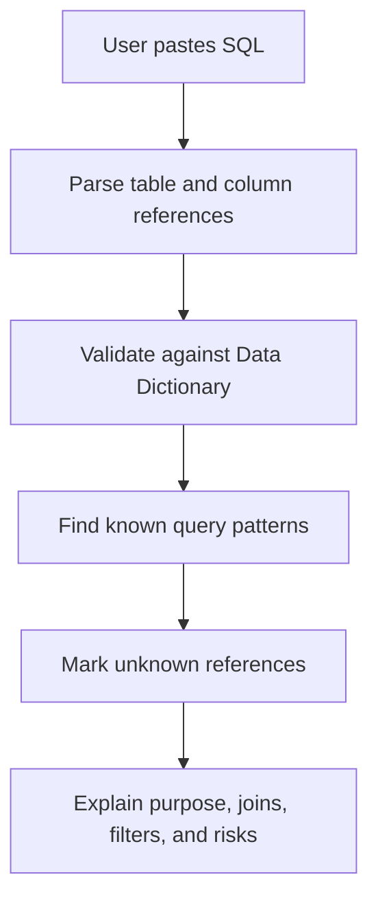

# Workbench Assistant SQL Helper Design

## Purpose

The SQL Helper is the most reasoning-heavy part of the Workbench Assistant. It
should help consultants draft OTM SQL queries without relying on a heavy local
LLM or unsafe free-form generation.

The helper should be grounded in:

- OTM Data Dictionary tables and columns;
- known relationships and validated join patterns;
- saved and approved query examples;
- explicit user-provided filters;
- source citations and confidence labels.

## Core Rule

The assistant must not invent OTM table or column truth. It can propose a draft
only when the referenced tables and columns resolve through the Data Dictionary
or an approved query/source pattern.

## SQL Helper Architecture



## Input Classes

| Input class | Example | Expected behavior |
|---|---|---|
| Table lookup | "shipment table columns" | return table/columns and source |
| Simple query | "shipment by gid" | draft select with filter |
| Join query | "shipment stops with locations" | resolve join pattern or clarify |
| Saved-query search | "query for rate offering lanes" | find approved examples |
| Explain query | pasted SQL | explain known tables/columns and flag unknowns |
| Troubleshoot SQL | "why column not found" | validate against Data Dictionary |

## Entity Extraction

The helper should extract:

```text
OTM table hints
column hints
business object terms
module context
filter terms
desired output fields
aggregation intent
join terms
date/status/domain constraints
```

Extraction should start with deterministic rules:

- exact table names;
- table aliases from known vocabulary;
- module-specific terms;
- Data Dictionary synonyms;
- saved query tags;
- fuzzy matching for near names.

## Table Resolution

Resolution output should include:

```json
{
  "table_name": "SHIPMENT",
  "match_type": "exact|synonym|fuzzy|saved_query",
  "confidence": "high|medium|low",
  "source": "data_dictionary",
  "reason": "Matched shipment business term to SHIPMENT table"
}
```

If multiple table families match, ask a clarification.

Example:

```text
Which shipment area do you want?
1. Shipment header
2. Shipment stops
3. Shipment status/events
4. Shipment/order relationship
```

## Column Resolution

Column resolution must verify:

- column exists in the selected table;
- data type when available;
- whether it is likely an identifier, date, status, amount, or reference;
- whether it appears in approved saved query examples.

Unknown columns should not be silently included. The assistant should instead
return:

```text
I could not confirm column X in the local Data Dictionary. I can search similar
columns or draft the query without that field.
```

## Join Pattern Strategy

Join patterns should be explicit records, not inferred only from similar names.

Recommended join pattern fields:

```text
pattern_id
name
left_table
left_column
right_table
right_column
join_type
business_meaning
confidence
source_type
source_id
validated_by
validated_at
```

Sources for join patterns:

- approved saved queries;
- Data Dictionary foreign-key/dependency metadata when available;
- manually curated OTM relationship notes;
- module-specific validated query patterns.

## Query Templates

Start with a small set of deterministic templates:

### Single Table Lookup

```sql
select
  {columns}
from {table}
where {filter_column} = :{filter_name}
```

### Two-Table Join

```sql
select
  {left_alias}.{left_columns},
  {right_alias}.{right_columns}
from {left_table} {left_alias}
join {right_table} {right_alias}
  on {left_alias}.{left_join_column} = {right_alias}.{right_join_column}
where {filters}
```

### Exists Filter

```sql
select
  {base_alias}.{base_columns}
from {base_table} {base_alias}
where exists (
  select 1
  from {related_table} {related_alias}
  where {related_alias}.{related_join_column} = {base_alias}.{base_join_column}
    and {related_filters}
)
```

These are templates, not final implementation code.

## SQL Draft Response

Required response fields:

```json
{
  "purpose": "Find shipments by status",
  "sql": "...",
  "parameters": [
    {
      "name": "shipment_gid",
      "description": "Shipment GID to filter"
    }
  ],
  "tables": [],
  "columns": [],
  "join_patterns": [],
  "assumptions": [],
  "warnings": [],
  "sources": [],
  "confidence": "high|medium|low"
}
```

## Safety Rules

- Prefer `select` drafts only.
- Do not generate `update`, `delete`, `merge`, `insert`, or DDL in the first
  assistant design unless a future admin-only mode is explicitly approved.
- Always parameterize user-supplied values.
- Mark generated SQL as a draft.
- Show sources for tables, columns, and joins.
- Ask clarifying questions instead of guessing high-risk joins.
- Keep client-specific values out of examples and docs.

## Explain Query Flow



The helper can explain:

- selected tables;
- joins;
- filters;
- likely business purpose;
- unknown columns/tables;
- risky broad filters;
- missing bind parameters.

## Saved Query Library

Saved query records should support:

```text
name
description
sql_text
module
tags
status: draft|approved|retired
scope: public|project|domain
source
created_by
reviewed_by
reviewed_at
tables
columns
join_patterns
```

Approved queries should rank higher than drafts. Retired queries should not be
returned by default.

## Confidence Model

| Confidence | Criteria |
|---|---|
| high | exact tables/columns, known join pattern, approved example exists |
| medium | exact tables/columns, no approved example, join pattern inferred from curated relationship |
| low | fuzzy table/column match, ambiguous business term, no join pattern |

Low confidence should produce either a clarification or a clearly marked
partial draft.

## Validation Before Future Implementation

When this design becomes implementation work, tests should cover:

- exact table lookup;
- fuzzy table lookup;
- unknown table;
- ambiguous table family;
- known column;
- unknown column;
- approved saved query match;
- two-table join from approved pattern;
- unsafe mutation request rejected;
- pasted SQL explanation with unknown references;
- non-DBA/public scope behavior for saved query visibility.

## Implemented Foundation

The first SQL Helper foundation supports deterministic local behavior only:

- unsafe mutation and DDL SQL are blocked;
- single-table SELECT drafts require Data Dictionary table and column matches;
- pasted single-table SELECT SQL can be explained with known and unknown
  columns;
- no SQL is executed;
- joins, saved query persistence, and AI generation remain outside this slice.

Implemented endpoints:

- `POST /api/v1/assistant/sql/draft`
- `POST /api/v1/assistant/sql/explain`

## Implemented Join Pattern Curation

The first join-pattern foundation is now implemented as a reviewed relationship
library, still separate from SQL draft generation:

- draft join patterns can be captured for two OTM table/column references;
- approval validates both sides against the local Data Dictionary;
- patterns sourced from a saved query require that saved query to be approved;
- approved patterns receive high confidence and become searchable;
- draft or warning-bearing patterns are not returned by default.

Implemented endpoints:

- `POST /api/v1/assistant/sql/join-patterns`
- `POST /api/v1/assistant/sql/join-patterns/{pattern_id}/approve`
- `GET /api/v1/assistant/sql/join-patterns`

Join SQL generation remains a future slice. The helper can now collect and
review trusted relationships, but it should not assemble multi-table SQL until
the generator consumes this approved-pattern library with citations.

## Implemented Joined SQL Draft

The first joined SQL draft foundation is implemented for explicit, approved
join patterns only:

- callers provide a reviewed `join_pattern_id`;
- the selected left/right output columns are validated against the Data
  Dictionary;
- the filter table must be one side of the approved pattern;
- the filter column is emitted as a bind parameter;
- `INNER` and `LEFT` pattern types are supported;
- `EXISTS`, multi-hop joins, automatic pattern selection, SQL execution, and UI
  integration remain out of scope.

Implemented endpoint:

- `POST /api/v1/assistant/sql/draft-join`

This keeps joined SQL generation lightweight and deterministic: the assistant
can assemble a draft from trusted relationship metadata, but it still does not
guess relationships from similar column names or execute the generated SQL.
