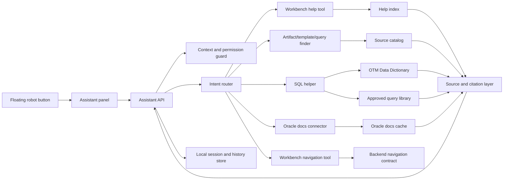
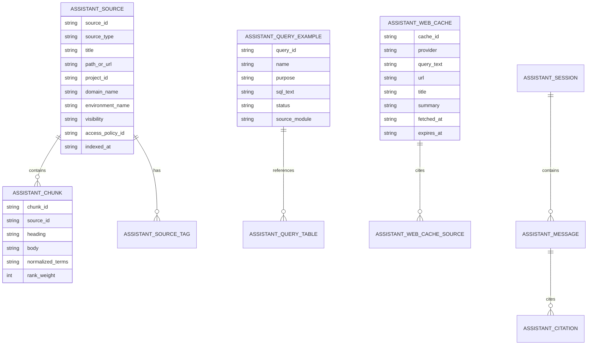
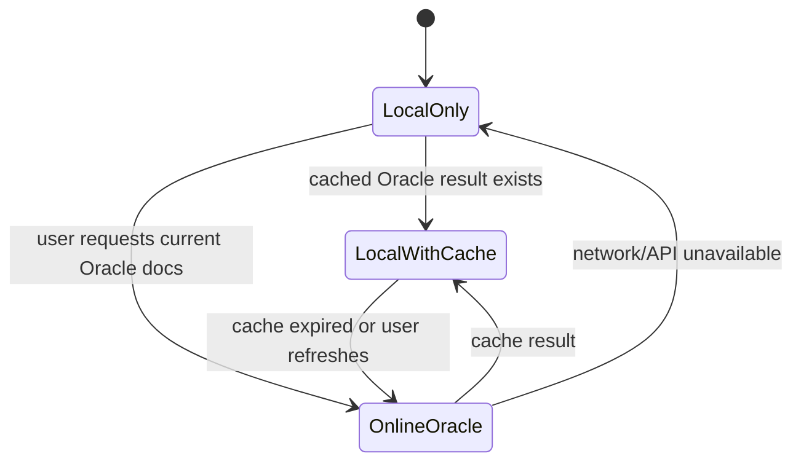

# Workbench Assistant Target Architecture

## Executive Summary

The Workbench Assistant should be implemented as a lightweight specialist
assistant embedded in the OTM Workbench shell. It should use local structured
knowledge, local full-text search, source-aware retrieval, permission checks,
and small deterministic tools before any AI call.

The long-term target is not a local ChatGPT replacement. The target is a
consultant-grade assistant that can answer:

- "How do I use this Workbench module?"
- "Where is the template or evidence for this client/domain?"
- "Which screen should I use for this task?"
- "Which OTM tables and columns should I query?"
- "Can you assemble a safe SQL draft from Data Dictionary and approved query
  patterns?"
- "What does the current official Oracle documentation say, and where is the
  link?"

## Architecture Principles

1. **Local-first knowledge.** Most answers should come from indexed local docs,
   module metadata, asset/template catalogs, Data Dictionary records, and saved
   query examples.
2. **Source-bound answers.** The assistant should show where an answer came
   from and whether the source is local, cached, official, or inferred.
3. **No heavy local model dependency.** The system should run on normal
   consultant machines without GPU requirements.
4. **Tool-based behavior.** The assistant should route user intent to narrow
   tools instead of asking one general model to solve every task.
5. **Scope-safe by default.** Every result must respect project/client-domain,
   environment, visibility, access policy, and Public View rules.
6. **Backend-owned truth.** The backend owns module metadata, permissions,
   available actions, source confidence, and assistant tool eligibility.
7. **Optional online cost.** Oracle documentation search and AI enhancement are
   explicit controlled modes with cache and cost visibility.

## High-Level Component Diagram



## Backend Module Boundary

Recommended future backend package:

```text
src/otm_workbench/assistant/
  routes.py
  models.py
  schemas.py
  intent.py
  search.py
  indexing.py
  sources.py
  permissions.py
  sql_helper.py
  oracle_docs.py
  navigation.py
  cache.py
```

The assistant should be included as a normal FastAPI router when promoted to
implementation:

```text
/api/v1/assistant/chat
/api/v1/assistant/suggestions
/api/v1/assistant/search
/api/v1/assistant/sql/draft
/api/v1/assistant/oracle-docs/search
/api/v1/assistant/sources/{source_id}
```

These route names are planning candidates and should be confirmed during
implementation design.

## Frontend Boundary

Recommended future frontend package:

```text
frontend/src/assistant/
  AssistantLauncher.tsx
  AssistantPanel.tsx
  AssistantMessageList.tsx
  AssistantInput.tsx
  AssistantSourceList.tsx
  AssistantQuickActions.tsx
  AssistantSqlDraft.tsx
  assistantTypes.ts
  useAssistant.ts
```

The assistant should mount globally inside `WorkbenchShell`, not as a top-level
navigation module. Closed state is a small lower-right button. Open state is a
right-side panel or large drawer with enough room for sources, SQL drafts, and
navigation actions.

## Data Model Concept

The local assistant store should separate sources, indexed chunks, cached web
results, conversations, and generated drafts.



## Search Strategy

The assistant should start from deterministic search:

```text
query normalization
  -> intent detection
  -> scope filtering
  -> source-type filtering
  -> FTS/BM25 search
  -> metadata boost
  -> source confidence scoring
  -> response template
```

Recommended local ranking signals:

- exact module/screen/action match;
- exact OTM table or column match;
- active client/domain/environment match;
- source type priority;
- version/current status;
- validation status;
- recent usage;
- approved query status;
- official Oracle source when online lookup is used.

## Intent Model

The assistant should classify into narrow intents:

| Intent | Purpose | Main sources | Online needed |
|---|---|---|---|
| `workbench_help` | Explain module/screen/action usage | help docs, route metadata | no |
| `find_artifact` | Find template, Excel, evidence, query, artifact | assets/catalog | no |
| `navigate` | Route user to module/screen | navigation contract | no |
| `sql_help` | Draft or explain SQL | Data Dictionary, query library | no |
| `oracle_docs` | Lookup official Oracle docs | Oracle docs connector/cache | sometimes |
| `error_help` | Explain known error/blocker | validation docs, error catalog | no |
| `ambiguous` | Ask a short follow-up | none | no |

## Scope Guard

Every assistant tool must receive the current context:

```text
user_id
role/capabilities
project_id
profile_id
client/domain
environment
visibility mode
access policy scope
route/module context
```

Public View should not become a shortcut into private data. In Public View, the
assistant can answer public Workbench help and official Oracle documentation
questions, but private template/file/query/evidence results must be hidden
unless explicitly public.

## Source Confidence

Every response should carry a confidence and source category:

| Category | Meaning |
|---|---|
| `local_indexed` | From local indexed Workbench/docs/source catalog |
| `local_validated` | From local source with validation/approved status |
| `data_dictionary` | From OTM Data Dictionary records |
| `saved_query` | From approved or draft query library |
| `official_live` | From live official Oracle documentation lookup |
| `official_cached` | From cached Oracle lookup with freshness timestamp |
| `inferred` | Derived from multiple sources; should be labeled carefully |

## Offline/Online Modes



Local-only mode must still support Workbench help, local artifact search, Data
Dictionary lookup, and SQL drafts from local sources.

## Cost Controls

Cost-bearing operations should be explicit:

- live Oracle web/API lookup;
- optional AI summarization;
- optional embeddings if introduced later.

Each assistant response should be able to expose:

```text
cost_level: local | web | ai | web_plus_ai
source_mode: indexed | cached | live_official | generated_draft
```

## Figma/Michelangelo Direction

Future visual artifacts should show:

- closed lower-right launcher;
- open assistant panel on a dense module screen;
- contextual quick actions per module;
- source/citation list;
- SQL draft review state;
- Oracle docs search result state;
- blocked/permission-denied state;
- offline/no-network state;
- ambiguous intent follow-up state.

The visual style should match the existing Workbench internal tool density and
should not look like a consumer chatbot. The robot identity can be playful in
the launcher, but the open panel should remain operational and source-focused.
