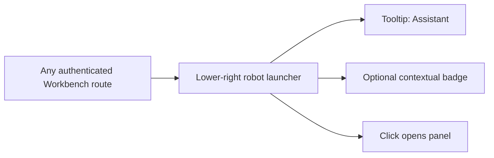
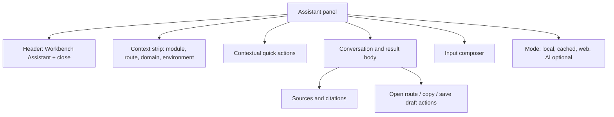
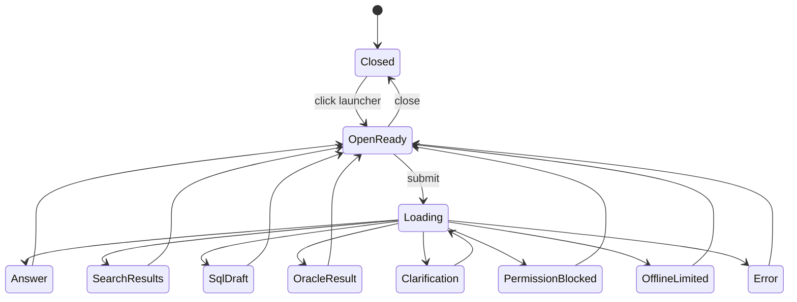

# Workbench Assistant UI Experience Spec

## Purpose

This document defines the future UI behavior for the Workbench Assistant before
any Figma, implementation, or prototype work. It focuses on interaction model,
states, accessibility, and how the assistant should fit into dense consultant
workflows without becoming a new top-level module.

## Primary User

The primary user is an OTM consultant working inside OTM Workbench during
implementation, data preparation, validation, evidence review, integration
mapping, query writing, and cutover support.

The consultant is expected to use the assistant frequently but briefly:

- asking how to use the current screen;
- finding a template, query, workbook, artifact, or evidence item;
- asking where to go next;
- drafting a SQL query;
- checking official Oracle documentation.

## UX Positioning

The assistant should feel like a focused Workbench utility, not a general chat
product.

```text
quiet when closed
contextual when opened
source-first when answering
permission-aware when searching
deliberate when using web/API
careful when drafting SQL
```

## Launcher

The launcher is a small lower-right floating button.

### Closed State

Behavior:

- visible on authenticated Workbench routes;
- anchored to the lower right;
- does not cover primary actions or table pagination;
- has an accessible name such as `Open Workbench Assistant`;
- shows a tooltip such as `Assistant`;
- can show a subtle status badge when contextual help is available;
- does not pulse, pop, or auto-open.

Visual direction:

- a small truck-driver robot identity is acceptable;
- keep the icon compact and friendly;
- avoid making the closed state look like a support chat bubble from a consumer
  website;
- use a shape that remains legible at small sizes.

### Closed State Diagram



## Open Panel

The open assistant should use a right-side panel or drawer, not a tiny chat
popover. SQL drafts, source cards, file results, and Oracle documentation links
need room.

Recommended panel regions:

```text
header
context strip
quick actions
message/results area
source/citation area
input composer
status/cost indicator
```

### Open Panel Layout Skeleton



## Context Strip

The context strip should show the scope used for answers.

Fields:

```text
module
route/screen label
project/profile when available
client/domain
environment
visibility mode
Public View indicator when active
```

Purpose:

- prevents users from assuming results are cross-client;
- makes permission and no-result messages easier to trust;
- helps the assistant route "this screen" and "this module" questions.

## Quick Actions

Quick actions should be backend-owned or backend-validated where possible.

Global quick actions:

- Help for this screen
- Find template or file
- Find saved query
- Draft SQL
- Search Oracle Docs
- Where do I do this?

Contextual examples:

| Module | Quick actions |
|---|---|
| Cockpit | Explain current context, Public View help, find project info |
| Master Data | Find template, validate dependency, draft SQL from table |
| Rates | Explain batch issue, find rate query, inspect table help |
| Load Plan | Find package evidence, explain CSVUTIL sequence, cutover help |
| Integration | Explain mapping rule, find payload artifact, Oracle docs |
| Order Release | Find template, explain XML preview, find generated artifact |
| Assets | Find file/template, explain version/link/archive |
| Settings | Explain grants/policies, find access-scope guidance |

## Conversation Modes

The assistant should expose modes through quick actions and internal routing,
not through a complex mode selector.

| Mode | User-facing behavior | Cost |
|---|---|---|
| Local help | Uses Workbench docs and route metadata | local |
| Finder | Searches scoped local catalog | local |
| Navigation | Suggests routes/actions | local |
| SQL helper | Uses Data Dictionary and saved queries | local |
| Oracle docs | Uses cache or live official docs lookup | cached/web |
| Optional AI | Summarizes or rewrites source-bound results | ai |

## Result Patterns

### Help Result

Required regions:

- short answer;
- steps;
- related actions;
- sources;
- confidence.

### Finder Result

Required regions:

- result cards;
- source type;
- scope;
- status/current version;
- open/copy action;
- no-access-safe messaging.

### SQL Draft Result

Required regions:

- purpose;
- SQL draft;
- assumptions;
- tables and columns used;
- sources;
- confidence;
- copy/save draft actions.

### Oracle Docs Result

Required regions:

- official link;
- short targeted summary;
- fetched or cached timestamp;
- source status;
- refresh action when cache exists.

## UI States



## Blocked And Error States

### Permission Blocked

The assistant must not reveal private result details.

Safe copy:

```text
I found matching material outside your current accessible scope. Change context
or request access if you expected to see it.
```

### Offline Limited

Safe copy:

```text
I can continue with local Workbench help, saved sources, Data Dictionary, and
cached Oracle pages. Live Oracle documentation lookup is unavailable right now.
```

### Ambiguous Intent

The assistant should ask one focused clarification:

```text
Do you want a Workbench help answer, a template/file search, or a SQL draft?
```

For SQL ambiguity:

```text
Which shipment area do you want to query: shipment header, shipment stops, or
shipment status/events?
```

## Accessibility Requirements

- Launcher has a stable accessible name.
- Panel traps focus only while modal/drawer behavior is active and returns
  focus to the launcher when closed.
- Escape closes the panel.
- Source links and action buttons are keyboard reachable.
- Color is not the only signal for cost, source confidence, or status.
- SQL blocks have copy buttons with accessible labels.
- Live results use a polite announcement region.
- Loading states prevent duplicate submit.

## Responsive Behavior

Desktop is the primary target.

For narrow widths:

- panel may occupy most of the viewport width;
- keep close button visible;
- avoid covering the active form's primary action without a visible close path;
- result cards stack vertically;
- SQL draft should scroll horizontally inside its own region.

## Visual Direction For Later Wireframes

Michelangelo/Figma work should use this direction:

```text
density: compact internal-tool
tone: precise, operational, consultant-focused
launcher: small friendly truck-driver robot
panel: restrained Workbench utility
primary hierarchy: context, answer, sources, actions
```

The assistant panel should avoid consumer chatbot patterns such as oversized
welcome copy, decorative gradients, empty mascot screens, or vague "ask me
anything" messaging.

## Future Figma Board Inventory

Recommended boards:

1. Launcher closed on dense module screen.
2. Open panel default with contextual quick actions.
3. Workbench help answer.
4. Finder results with scoped result cards.
5. SQL draft review.
6. Oracle docs result with cached/live source state.
7. Permission blocked result.
8. Offline limited result.
9. Ambiguous SQL clarification.
10. Mobile/narrow panel behavior.

## Implemented UI Shell Foundation

The first embedded Assistant UI shell is implemented in the React Workbench
shell:

- authenticated users see a small lower-right launcher named
  `Open Workbench Assistant`;
- the launcher opens a compact `Workbench Assistant` panel and remains outside
  the backend-owned sidebar navigation;
- the panel checks `/api/v1/assistant/health`;
- the panel shows a compact `Current screen` context strip derived from the
  active backend-owned navigation route;
- first-pass quick actions prefill existing fields for `Help for this screen`,
  `Find template`, and `Search Oracle docs`;
- local Workbench source search calls `/api/v1/assistant/search`;
- Oracle docs questions call `/api/v1/assistant/oracle-docs/live-lookup` and
  display the sanitized query plus official Oracle search action;
- SQL Helper draft requests call `/api/v1/assistant/sql/draft` and render a
  read-only SQL preview with a reminder that Assistant drafts are not executed;
- pasted SQL review calls `/api/v1/assistant/sql/explain` and renders
  Data Dictionary warnings without executing the statement;
- no live Oracle web request is executed by the UI;
- the shell can be closed with `Close Workbench Assistant`.

This is intentionally a foundation shell, not a complete conversation UI. Rich
message history, richer source cards, joined SQL draft controls, copy/save
draft actions, focus trapping, and saved assistant history remain future
slices.
